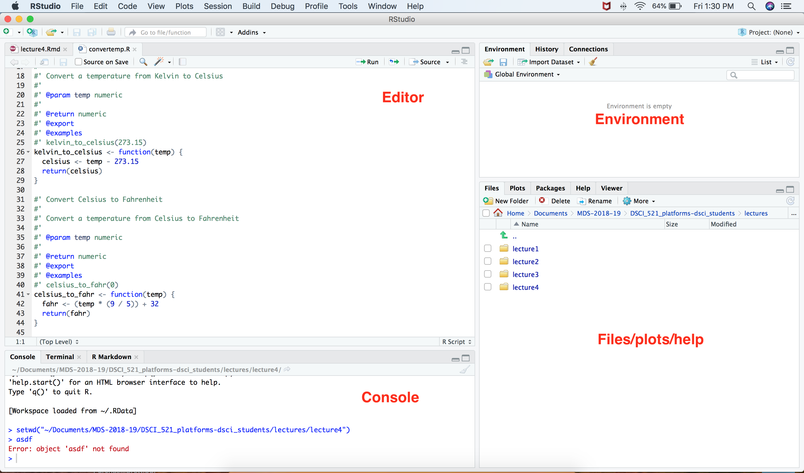

```{r setup, include=FALSE}
options(htmltools.dir.version = FALSE)
```

background-image: url(https://upload.wikimedia.org/wikipedia/commons/b/be/Sharingan_triple.svg)

???

Image credit: [Wikimedia Commons](https://commons.wikimedia.org/wiki/File:Sharingan_triple.svg)


---
class: center, middle

# xaringan

### /ʃæ.'riŋ.ɡæn/

---

## Lecture learning goals:

### By the end of this week, you should be able to:
- Use RStudio to create, edit and run an Rscript 
- Use RStudio to access the help files
- Use RStudio to edit, create and run R Markdown documents (for reports and presentations)

---

class: inverse, center, middle

# RStudio - an introduction

---

# RStudio

An integrated development environment (IDE) for R *(primarily)*. It is:

1. helpful
  - code completion
  - linting (highlighting of syntax errors BEFORE you run your code)
  - debugging tools
  
2. flexible
  - has literate programming and notebook-like functionality
  - has editor and console panes for software development of scripts & packages
---



---

## Running Rscripts Interactively in RStudio

- Simplest way to use and run R code in RStudio

- Create a new R script from the menu File -> New File -> R Script

- Write your R code the document that shows up in the editor

- Run your code one of several ways:
    - using the "Source" button (upper right-hand side) to run the entire document
    - by typing Ctrl+Enter (Command+Enter on Mac OS) to run the current line or highlighted code

--

**Give it a try!** Type the R code below and try running it all of the ways described above.
```
x <- 5
print(x)
```

---

## Code output

When running R code in the console output ends up in one of to places, depending on the type of output:

textual output - printed to the console

graphical output - displayed in the Plots pane


--

**Give it a try!** See how graphical output is displayed in RStudio by typing the code below in your editor and then running it.
```
boxplot(mtcars$mpg, grouping(mtcars$cyl))
```

---

## Gettin help in RStudio

If you want to know more about what a function or package does, its a similar command to getting help in Jupyter, either:

```
?function_name
```

or

```
help(function_name)
```

Help then arrives in the panel in the bottom right-hand pane of your IDE.

--

**Give it a try!** Try getting the help for the function named `mean`.


---

## Where am I? (or the files pane)

Different from Jupyter, when you open RStudio you open a `.R` or `.Rmd` file the RStudio, the current working directory is **not** neccesarily the project working directory, or the directory of the file you opened.


---

## Where am I? (or the files pane)

**EVERY SESSION** you need to tell RStudio where you are working. Especially if you are loading other files outside of your `.R` or `.Rmd` file.

So, where are you when you open RStudio? You can find out one of two ways:

1. type `getwd()` in the console

2. In the files pane, click the cog/More button and then click "Go To Working Directory"

--

**Give it a try!** Figure out what your RStudio's current working directory is using both methods.

---

## Where should I be?

To make your life easier, set your working directory to the root directory of the Git repository you are working in!


---

## Setting the working directory

You can set the working directory using the following 3 ways:

1. type `setwd("PATH")` in the console

2. In the files pane, navigate the file structure to where you want the working directory to be. Then click the cog/More button and then click "Set As Working Directory"

3. In the Session menu, click Set Working Directory and then Choose Directory. Navigate the opened file brower to choose the directory. 

--

**Give it a try!** Use each method to set the working direcytory to a different place. Each time, verify it worked each time by typing `getwd()` in the console.

---

## Setting the working directory is important!

If you are working in RStudio and then you start looking like this - you probably forgot to set the working directory.


---

## Using R through R Markdown in RStudio

See [lab 3](https://github.ubc.ca/MDS-2018-19/DSCI_521_platforms-dsci_students/blob/master/release/lab3/lab3.Rmd)!
