## Warm-up discussion:

- Let's share our past file management choices, successes and failures.
- For example:
  - are there file names that have caused you (or are causing you) headaches?
  - are there projects or aspects to your computer's organization structure that have made things hard to find?
  
## Names matter

## What works, what doesn't?

**NO**

~~~
myabstract.docx
Joe’s Filenames Use Spaces and Punctuation.xlsx
figure 1.png
fig 2.png
JW7d^(2sl@deletethisandyourcareerisoverWx2*.txt
~~~

**YES**

~~~
2014-06-08_abstract-for-sla.docx
joes-filenames-are-getting-better.xlsx
fig01_scatterplot-talk-length-vs-interest.png
fig02_histogram-talk-attendance.png
1986-01-28_raw-data-from-challenger-o-rings.txt
~~~

## Three principles for (file) names

1. Machine readable

2. Human readable

3. Plays well with default ordering

## Awesome file names :)

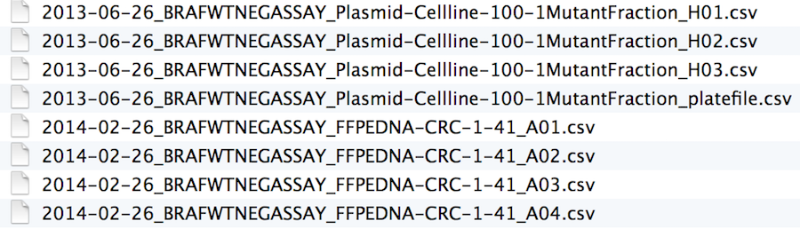

# Machine readable

## Machine readable

- Regular expression and globbing friendly
    + Avoid spaces, punctuation, accented characters, case sensitivity

- Easy to compute on
    + Deliberate use of delimiters
    
## Globbing

**Excerpt of complete file listing:**

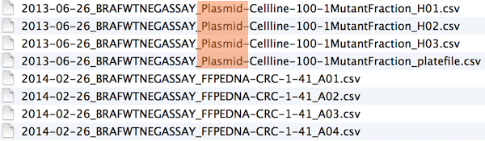

**Example of globbing to narrow file listing:**

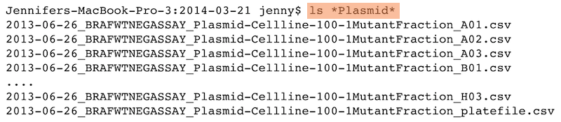

## Same using Mac OS Finder search facilities

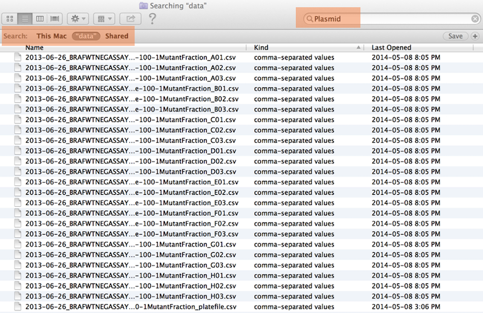

## Same using regex in R

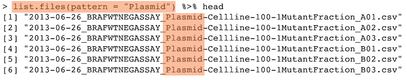

## Punctuation {.smaller}

Deliberate use of `"-"` and `"_"` allows recovery of meta-data from the filenames:

- `"_"` underscore used to delimit units of meta-data I want later
- `"-"` hyphen used to delimit words so my eyes don't bleed

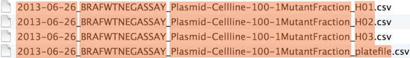

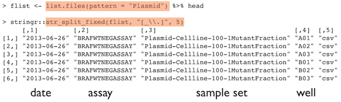

This happens to be R but also possible in the shell, Python, etc.

## Recap: machine readable

- Easy to search for files later

- Easy to narrow file lists based on names

- Easy to extract info from file names, e.g. by splitting

- New to regular expressions and globbing? be kind to yourself and avoid
    + Spaces in file names
    + Punctuation
    + Accented characters
    + Different files named `foo` and `Foo`
    
# Human readable

## Human readable

- Name contains info on content

- Connects to concept of a *slug* from semantic URLs

## Example

**Which set of file(name)s do you want at 3 a.m. before a deadline?**

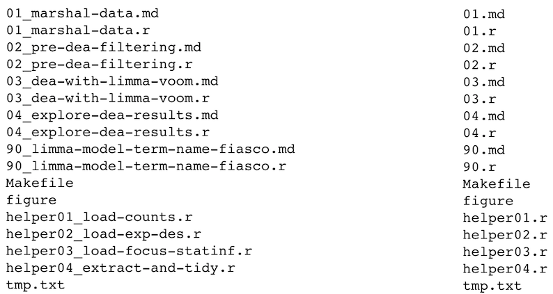

## Embrace the slug

slug filenames
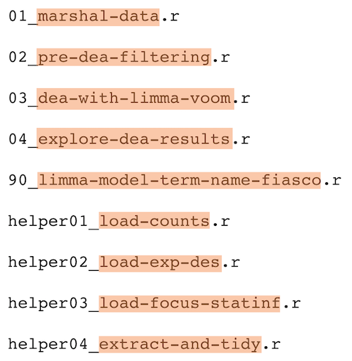

slug

## Recap: Human readable

Easy to figure out what the heck something is, based on its name

# Plays well with default ordering

## Plays well with default ordering

- Put something numeric first

- Use the ISO 8601 standard for dates

- Left pad other numbers with zeros

## Examples

**Chronological order:**

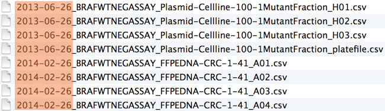

**Logical order:** Put something numeric first

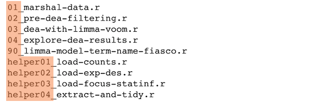

## Dates

Use the ISO 8601 standard for dates: YYYY-MM-DD

##

## Comprehensive map of all countries in the world that use the MM-DD-YYYY format

 

From https://twitter.com/donohoe/status/597876118688026624.

## Left pad other numbers with zeros

 

If you don’t left pad, you get this:

~~~
10_final-figs-for-publication.R
1_data-cleaning.R
2_fit-model.R
~~~

which is just sad :(

## Recap: Plays well with default ordering

- Put something numeric first

- Use the ISO 8601 standard for dates

- Left pad other numbers with zeros

## Recap

## Three principles for (file) names

1. Machine readable

2. Human readable

3. Plays well with default ordering

## Pros

- Easy to implement NOW

- Payoffs accumulate as your skills evolve and projects get more complex

## Go forth and use awesome file names :)

 

## {.flexbox .vcenter}

A place for everything, everything in its place.

 

Benjamin Franklin

---

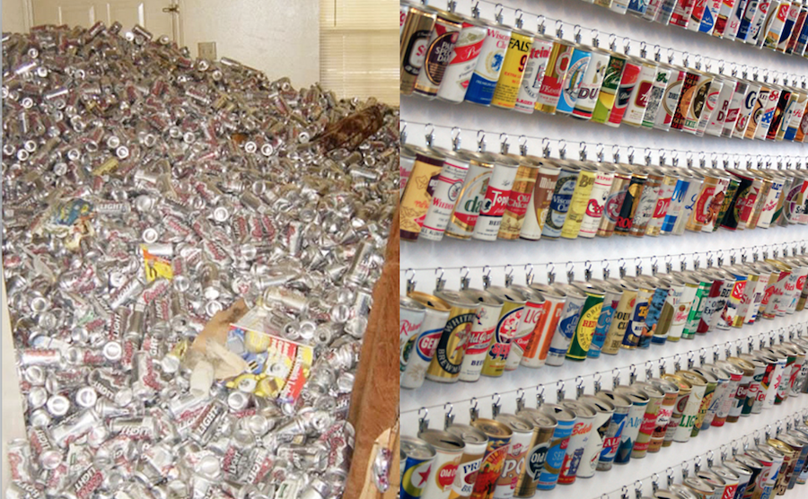

---

## Data analysis workflow

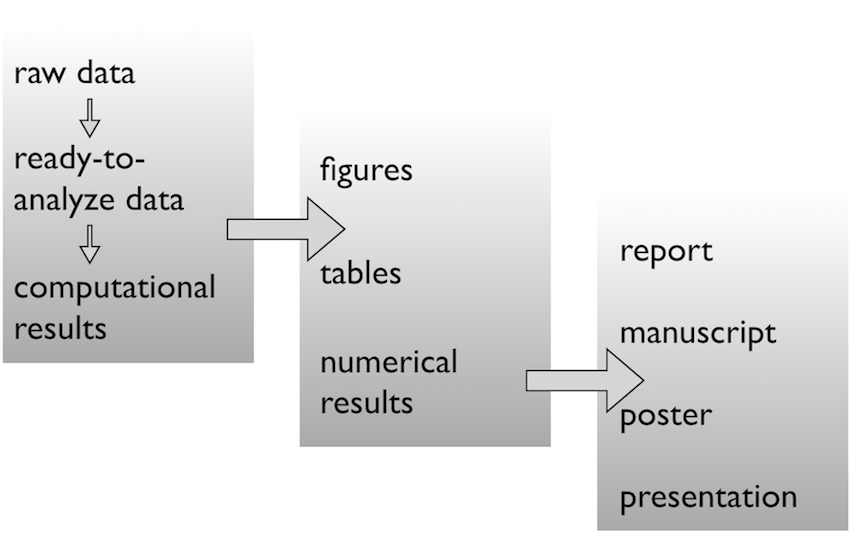

## Face it...

- There are going to be files

- LOTS of files

- The files will change over time

- The files will have relationships to each other

- It'll probably get complicated

## Mighty weapon

- File organization and naming is a mighty weapon against chaos

- Make a file's name and location VERY INFORMATIVE about what it is, why it exists, how it relates to other things

- The more things are self-explanatory, the better

- READMEs are great, but don't document something if you could just make that thing self-documenting by definition

# Organizing your data analysis workflow

## Raw data $\rightarrow$ data

Pick a strategy, any strategy, just pick one!

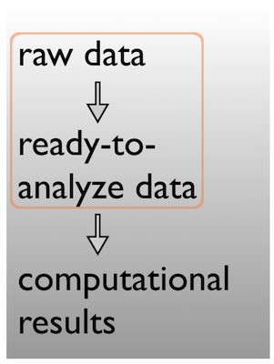

~~~
data

data-raw
data-clean

data/
  - raw
  - clean
~~~

## Data $\rightarrow$ results

Pick a strategy, any strategy, just pick one!

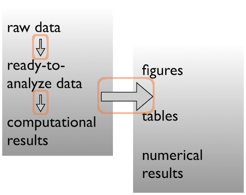

~~~
code

scripts

analysis

bin
~~~

## Data $\rightarrow$ results

Pick a strategy, any strategy, just pick one!

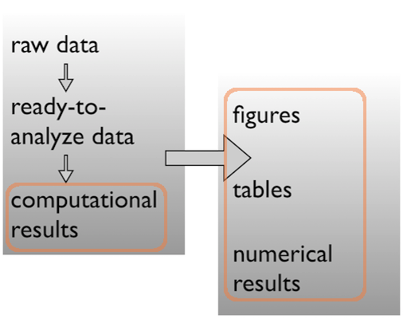

~~~
figures
results

results/
  - figs
  - nums

figures
tables
~~~

# A real (and imperfect!) example

##

~~~
  /Users/jenny/research/bohlmann/White_Pine_Weevil_DE:
  total used in directory 246648 available 131544558
  drwxr-xr-x  14 jenny  staff        476 Jun 23  2014 .
  drwxr-xr-x   4 jenny  staff        136 Jun 23  2014 ..
  -rw-r--r--@  1 jenny  staff      15364 Apr 23 10:19 .DS_Store
  -rw-r--r--   1 jenny  staff  126231190 Jun 23  2014 .RData
  -rw-r--r--   1 jenny  staff      19148 Jun 23  2014 .Rhistory
  drwxr-xr-x   3 jenny  staff        102 May 16  2014 .Rproj.user
  drwxr-xr-x  17 jenny  staff        578 Apr 29 10:20 .git
  -rw-r--r--   1 jenny  staff         50 May 30  2014 .gitignore
  -rw-r--r--   1 jenny  staff       1003 Jun 23  2014 README.md
  -rw-r--r--   1 jenny  staff        205 Jun  3  2014 White_Pine_Weevil_DE.Rproj
  drwxr-xr-x  20 jenny  staff        680 Apr 14 15:44 analysis
  drwxr-xr-x   7 jenny  staff        238 Jun  3  2014 data
  drwxr-xr-x  22 jenny  staff        748 Jun 23  2014 model-exposition
  drwxr-xr-x   4 jenny  staff        136 Jun  3  2014 results
~~~

## Data

Ready to analyze data:

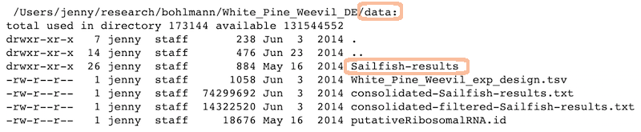

Raw data:

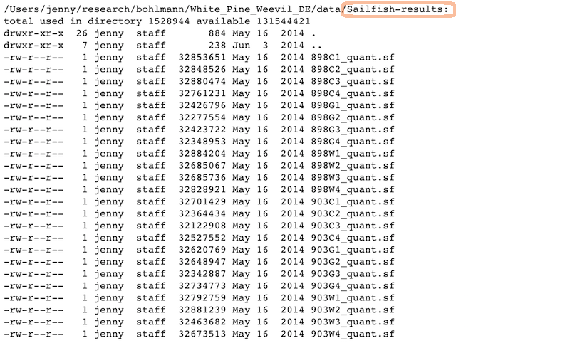

## Analysis and figures

R scripts + the Markdown files from "Compile Notebook":

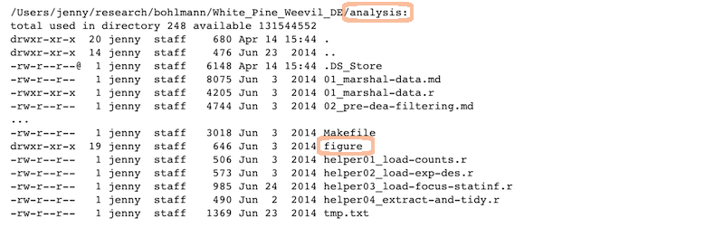

The figures created in those R scripts and linked in those Markdown files:

## Scripts

Linear progression of R scripts, and Makefile to run the entire analysis:

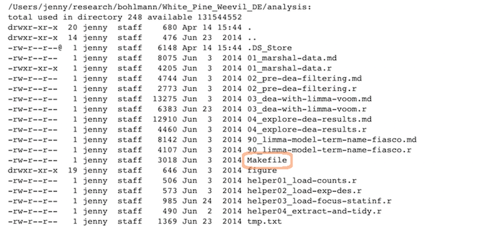

## Results

Tab-delimited files with one row per gene of parameter estimates, test statistics, etc.:

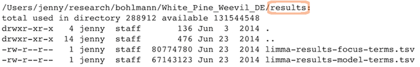

## Expository files

Files to help collaborators understand the model we fit: some markdown docs, a Keynote presentation, Keynote slides exported as PNGs for viewability on GitHub:

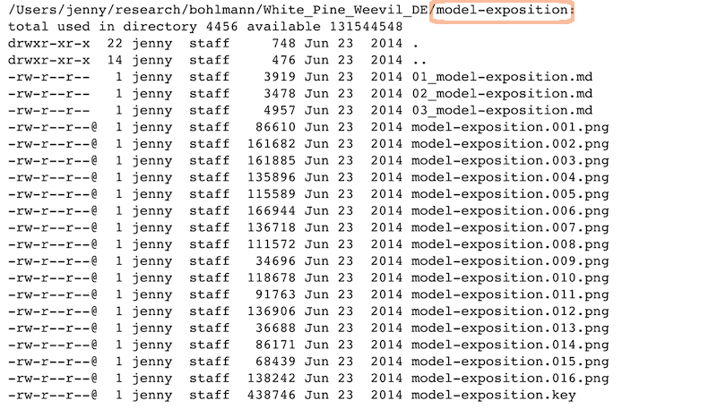

## Caveats / problems with this example

- This project is no where near done, i.e. no manuscript or publication-ready figs

- File naming has inconsistencies due to three different people being involved

- Code and reports/figures all sit together because it’s just much easier that way w/ knitr & rmarkdown

## Wins of this example

- I can walk away from the project and come back to it a year later and resume work fairly quickly

- The two other people (the post-doc whose project it is + the bioinformatician for that lab) were able to figure out what I did and decide which files they needed to look at, etc.

GOOD ENOUGH!

## Attribution:

- Slides borrowed from the [Data Carpentry](https://datacarpentry.org/) [Reproducible Science Workshop](https://datacarpentry.org/rr-organization1/)