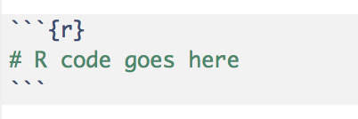
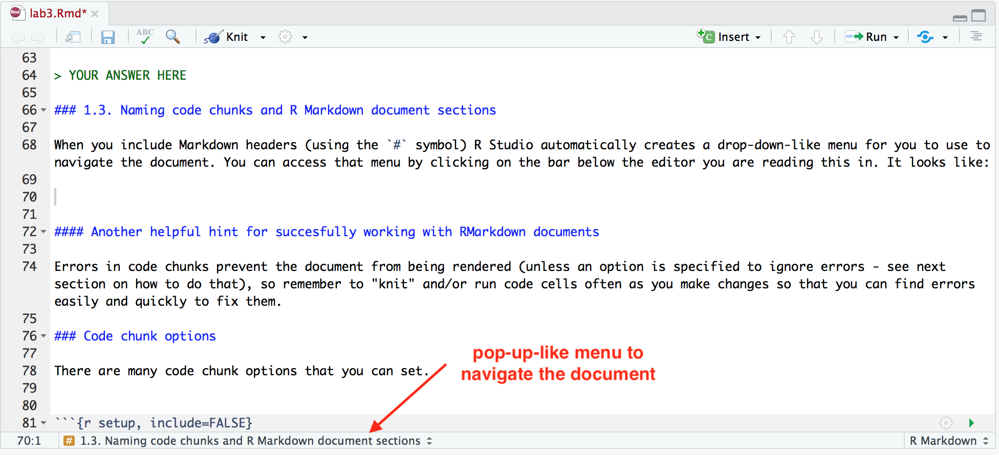
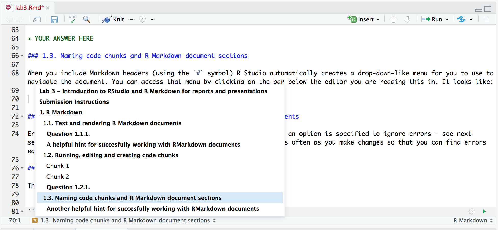
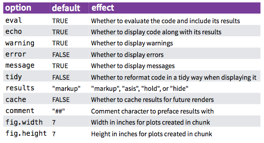
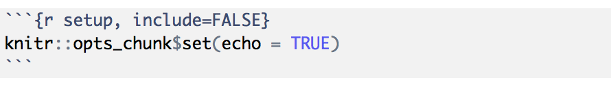
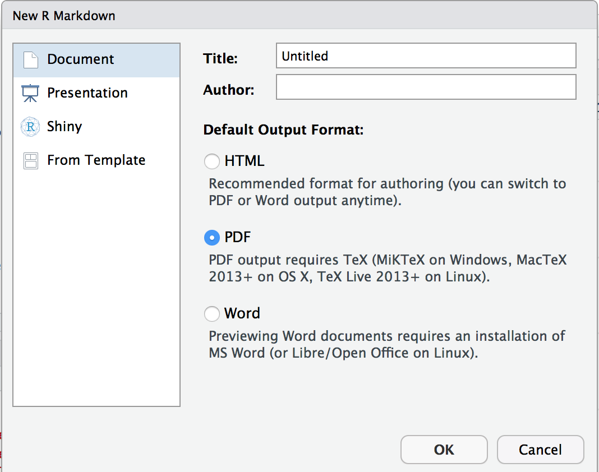
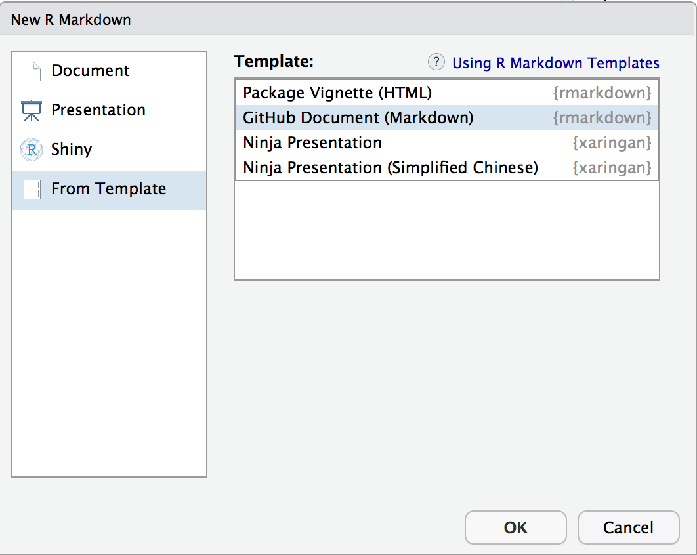
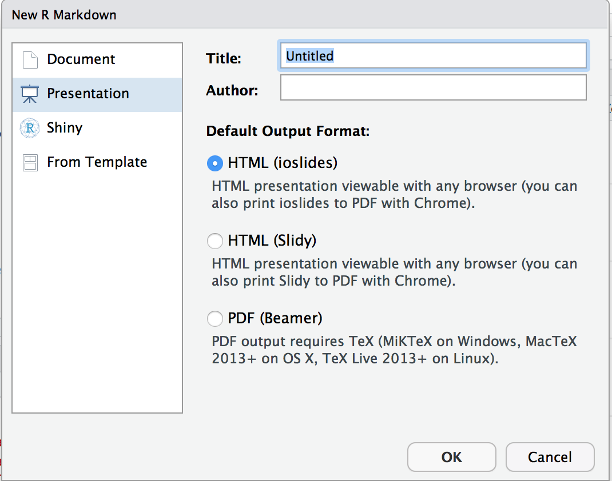
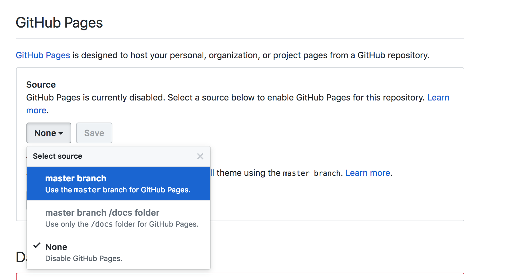

```{r setup, include=FALSE}
knitr::opts_chunk$set(echo = TRUE)
```

In Lab 3, you will learn how to use, edit and create a R Markdown document (like this one) using RStudio. You should follow the instructions in the document to complete the assignment.

If you need help as you use R Markdown in this lab and others in the future, consult the following resources:
- [R Markdown Cheat Sheet](https://rmarkdown.rstudio.com/lesson-15.html) 
- [R Markdown Reference Guide](https://www.rstudio.com/wp-content/uploads/2015/03/rmarkdown-reference.pdf)
- [R Markdown lessons from RStudio](https://rmarkdown.rstudio.com/lesson-1.html)
- [R Markdown: The Definitive Guide](https://bookdown.org/yihui/rmarkdown/)

## Submission Instructions
rubric={mechanics:2}

- [Follow the general lab instructions](https://ubc-mds.github.io/resources_pages/general_lab_instructions/)

## 1.0. Editing R Markdown documents
This document is called a R Markdown document. It is a literate code document, similar to Jupyter notebooks where you can write code and view their results. 

### 1.1. Text and rendering R Markdown documents

In a RMarkdown document any line of text not in a code chunk (like this line of text) will be formatted using Markdown. Similar to Jupyter, you can also use HTML and LaTeX here to do more advanced formatting. 

Unlike Jupyter, you do not get to see these Markdown sections rendered on their own. To see this text rendered as Markdown, you need to render the whole document. You can do that clicking the "Knit" button on the top, which looks like this:


 
Try rendering (or "knitting") this document now by clicking the "Knit" button on the top. When you do this, a Markdown (`.md`) file will be created and new window will pop up with your rendered document. 

#### Question 1.1.1.
rubric={correctness:1}

Try editing this markdown document so that **this** sentence is the last sentence in this paragraph, and then select the "Knit" button on the top.  This sentence, for example, should be deleted.  So should this one.

#### A helpful hint for succesfully working with RMarkdown documents

Given that you need to render the entire document to see you Markdown and LaTeX rendered it is important to "knit" often as you make changes. If you make an error in a LaTeX equation for example it will stop the knitting/rendering process and you will not get to see the rendered document. So by knitting/rendering often as you make changes you will know where the last changes you made are and then will be able to easily identify and fix your errors. 

### 1.2. Running, editing and creating code chunks

Instead of code cells (as in Jupyter), R Markdown has code chunks. These always start with 3 backticks (\`\`\`) followed by curly braces containing the language engine you want to run (usually r): `{r}`. Code is entered on the lines below and the code chunk is closed by 3 more backticks (\`\`\`).




Below is an example of a code cell. It is run when you knit/render the entire document. By default, the code in the chunk and the code output will be included in your rendered Markdown (`.md`) document. You can also run the code by clicking the green play button on the right-handside of the code chunk. The button looks like this: 


Now try running the code below both ways.

```{r}
x <- 5
x <- x + 1
print(x)
```

As mentioned above, you can use other language engines in code chunks, in the code chunk below we use Python.

```{python}
x = 5
x += 1
print(x)
```

There are other language engines that can be used in RMarkdown, you can learn more about that [here](https://bookdown.org/yihui/rmarkdown/language-engines.html).

#### Question 1.2.1.
rubric={mechanics:1}

Create a new code chunk below using the r language engine that runs some R code (it does not need to be complicated, but it should have an outptut). Ensure that you can render/knit the document after you add that chunk.

> YOUR ANSWER HERE

### 1.3. Naming code chunks and R Markdown document sections

When you include Markdown headers (using the `#` symbol) R Studio automatically creates a pop-up-like menu for you to use to navigate the document. You can access that menu by clicking on the bar below the editor you are reading this in. It looks like:






By clicking on any of the options in the pop-up-like menu, RStudio will navigate you to that section of the R Markdown document. Try clicking on one to see how it works.

In addition to Markdown headers, RStudio also keeps track of code chunks in that menu. By default RStudio names the chunks by their position (e.g., Chunk 1, Chunk 2, etc). But in reality those names are not that useful. It is helpful to give code chunks meaningful names. For example, in the code chunk below where we use a for loop to sum the numbers from 1 to 10, we name the chunk "for loop sum". We provide this name after providing the code chunk language engine inside the curly braces:

```{r for loop sum}
# initialize sum to 0
sum <- 0

# loop of a sequence from 1 to 10 and calculate the sum
for (i in seq(1:10)){
  sum <- sum + i
}

print(sum)
```

#### Question 1.3.1.
rubric={mechanics:1}

Use the pop-up-like menu to navigate to the unnamed code chunks (currently labelled Chunk 2, Chunk 3 and Chunk 4) and give them meaningful names. Don't forget to knit/render the document after you make this change to ensure everything is still working.


#### More helpful hint for succesfully working with RMarkdown documents

- Errors in code chunks prevent the document from being rendered (unless an option is specified to ignore errors - see next section on how to do that), so remember to "knit" and/or run code cells often as you make changes so that you can find errors easily and quickly to fix them.

- Do not duplicate code chunk names, this will break the rendering of your document!

### 1.4. Code chunk options

There are many code chunk options that you can set. These options let you choose many things, including whether a chunk is evaluated, whether to include the output in the rendered document, etc. A short list of code chunk options is shown below, but you can find an extensive list starting on the second page of [this](https://www.rstudio.com/wp-content/uploads/2015/03/rmarkdown-reference.pdf) document.



You can set the chunk options at either a global level (once set they will be applied to all code chunks in the `.Rmd` file) or locally for a specific chunk (these will override the global chunk options if they are contradictory).

Global options are usually set in one chunk at the top of the document. You already saw the one at the top of this document, it looks like this (this is a screenshot):



Global chunk options are set by adding them as arguments to `knitr::opts_chunk$set(...)` (put them in place of `...` and separate multiple options with a comma). The only global chunk options set in this document is `echo = TRUE` which enables code to be displayed along with the results.

Local chunk options are set by adding the options in the curly braces of a code chunk after the language engine and code chunk name. For example, to not display warnings in a single code chunk we would use the `warning = FALSE` code chunk as follows:

```{r correlation no warning, warning = FALSE}
# some R code that throws a warning
cor( c( 1 , 1 ), c( 2 , 3 ) )
```

#### Question 1.4.1.
rubric={mechanics:1,reasoning:1}

Create a new code chunk that uses a different local code chunk option that the one demonstrated above. Write in english what the code chunk option is doing.

> YOUR ANSWER GOES HERE

####  Multiple local code chunk options

To have multiple local code chunk options you separate them by a comma. For example, if in addition to suprressing warnings, we want to run the code but not output the results, then we can add the `include = FALSE` argument to the code chunk after the `warning = FALSE` option:

```{r correlation no warning and no output, warning = FALSE, include = FALSE}
# some R code that throws a warning
cor( c(1, 1), c(2, 3) )
```

#### Question 1.4.2.
rubric={mechanics:1,reasoning:1}

Create a new code chunk that uses at least two local code chunk options. At least one must be different to the ones demonstrated above. Write in english what each code chunk option is doing.

### 1.5. YAML Header and document output options

R Markdown files contains three types of content:

1. plain text mixed with simple Markdown formatting
2. code chunks surrounded by ```s
3. An (optional) YAML header surrounded by ---s

You have been introduced the first two types of content, but not the first (although you probably saw it at the top of this document). 

The (optional) YAML header which is located at the very top of R Markdown files sets some general global parameters, including:

- title
- author
- output
- etc

**Example YAML Header**

```
---
title: "Reproducible Data Science Report"
author: "Tiffany Timbers"
date: "September 4, 2018"
output: github_document
---
```

Most important from a workflow perspective is **output**. Possible output options include:

- `output: github_document`
- `output: html_document`
- `output: pdf_document`
- `output: word_document`
- `output: beamer_presentation` (beamer slideshow - pdf)
- `output: ioslides_presentation` (ioslides presentation - html)
- `output: xaringan::moon_reader` (xaringan presentation - html)
   
#### Question 1.5.1.
rubric={mechanics:1}

Navigate to the YAML header at the very top of this document and edit it so that you include an `author` (yourself) and a `date` (lab due date) included. 

#### Question 1.5.2.
rubric={mechanics:1}

Navigate to the YAML header at the very top of this document and edit it so that you change the `output` to `pdf_document`. Then knit/render this document. Note the different output. Add and commit that rendered `.pdf` file to the GitHub repository for this lab and paste a link to that file below this question. Then, change the `output` of this document back to `github_document` (quicker to render and easier to read IMHO).

> PASTE THE LINK TO YOUR RENDERED PDF VERSION OF THIS FILE HERE

### 2.0. Creating R Markdown documents

You can use the "File" menu inside RStudio to create new R Markdown documents by selecting: File > New File > R Markdown...


This will bring you to another menu where you can choose the type of output (don't be afraid to pick something, you can always change the `output` type once you have the `.Rmd` file).



To make a written report, we generally recommend using `output: github_document` as it is easier to read than PDF (note - LaTeX does not render nicely in such documents sadly, so if you are using a lot of LaTeX then you may want to choose `output: pdf_document`). To get this from the menu above you need to navigate to the "From Template" option on the left panel and then select "GitHub Document (Markdown)".



To create a presentation we recommend using either ioslides or xaringan. ioslides are simpler and easier to learn if you are new to R Markdown, and so if that is you, we recommend starting there. If you are a seasoned R Markdown user (or when you later become one in MDS then we recommend using xaringan.

To get an ioslides presentation from the File > New File > R Markdown... menu, you need to navigate to the "Presentation" option on the left panel and then select "HTML (ioslides)".



To get a xaringan presentation from the File > New File > R Markdown... menu, you need to navigate to the "From Template" option on the left panel and then select "Ninja Presentation".


When you create R Markdown documents this way, RStudio gives you a template and some reasonable defaults to start the document with to help you get going quickly and easily.


#### Question 2.0.0.
rubric={mechanics:58

1. Create a new R Markdown report (a different file than this one) in the same directory as this Markdown file. Use `github_document` as the `output`.

2. Create at least two Markdown text sections (each should have a header) and at least two separate code cells in it (these can be really simple). Save the new R Markdown document and  give it a meaningful name.

3. Render/knit the new R Markdown document to get a `.md` file. Put the new R Markdown document and the rendered `.md` file under version control using Git, and push/upload the file to your GitHub repository for this homework. Paste a link to these files as your answer below.

> PASTE THE LINK TO YOUR NEW R MARKDOWN DOCUMENT AND THE RENDERED `.md` FILE HERE


#### Question 2.0.1. (Optional)
rubric={mechanics:1,reasoning:1}

1. Take the R Markdown report created in Question 2.0.0 and change the output to `html_document` and render it. Put the rendered `.html` file under version control using Git, and push/upload the file to your GitHub repository for this homework. Try to look at the file on GitHub.ubc.ca in your homework repo? What do you see?

2. Create a new repo on GitHub.com (with a README.md file) and add this `.html` file there. Try to look at that `.html` file on GitHub.com in the repo you just created? What do you see?

3.Enable this GitHub repository (on GitHub.com) to be viewed as a website by selecting the master branch as the source in the GitHub Pages panel in the Settings Page. Click "Save".



4. In the repo on GitHub.com, create a link to your `.html` file in the `README.md` file and commit that change to your README. Then go to the website URL for your repo (you will find it at the top of the GitHub Pages panel in the Settings Page ) and click on the link you created the view your `.html` file. What do you see? 

5. Below paste a link to the webpage URL where you were able to nicely view your rendered `.html` page using GitHub Pages. Also in 1-2 sentences discuss when using this might be useful (hint - how does LaTeX render here)?

> YOUR ANSWER GOES HERE

#### Question 2.0.2.
rubric={mechanics:8}

1. Create a presentation using R Markdown. Do this in a different file than this one but in the same directory as this Markdown file. Use either ioslides (see [this tutorial](https://rmarkdown.rstudio.com/ioslides_presentation_format#overview)) or xaringan (see [this tutorial](https://bookdown.org/yihui/rmarkdown/xaringan.html)) as the presentation type. Give this file a meaningful name.
2. Create at least 4 slides. At least two slides must include a code chunk (these can be really simple). Save the new R Markdown document.
3. Render/knit the new R Markdown document to get a `html` presentation file.  
4. Put the new R Markdown document and the rendered `.html` file under version control using Git, and push/upload the file to your GitHub repository for this homework.
5. Open the `.html` presentation file and print/export to PDF from your browser. Put the PDF under version control using Git, and push/upload the file to your GitHub repository for this homework (this is so you have a previewable file in your homework repo).
5. Paste a link to these files as your answer below.

> PASTE THE LINK TO YOUR NEW R MARKDOWN DOCUMENT, THE RENDERED `.html` AND THE PDF FILE HERE

#### Question 2.0.3.
rubric={mechanics:8}

1. Create a presentation using the [RISE package](https://damianavila.github.io/RISE/) and Jupyter. You will need to install RISE, instructions how to do this are [here](https://damianavila.github.io/RISE/installation.html). Give the notebook file a meaningful name.
2. Follow the [RISE Usage documents](https://damianavila.github.io/RISE/usage.html#usage) to create at least 4 slides. At least two slides must include a code chunk (these can be really simple). Save the new Jupyter notebook.
3. Follow the instructions [here](https://damianavila.github.io/RISE/usage.html#pdf-export) to create a `.pdf` version of your slides (this is so you have a previewable file in your homework repo).
4. Put the new Jupyter notebook document and the rendered `.pdf` file under version control using Git, and push/upload the file to your GitHub repository for this homework.
5. Paste a link to these files as your answer below.

> PASTE THE LINK TO YOUR NEW JUPYTER NOTEBOOK DOCUMENT, THE RENDERED PDF FILE HERE

#### (Optional) Question 2.0.4. 
rubric={reasoning:1}

In a paragraph or two, compare and contrast the use of reproducible tools (e.g., R Markdown and Jupyter) and non-reproducible tools (Word, Powerpoint, Keynote, etc) for presentations and reports. Include advantages and disadvantages for each.

> YOUR SOLUTION GOES HERE
